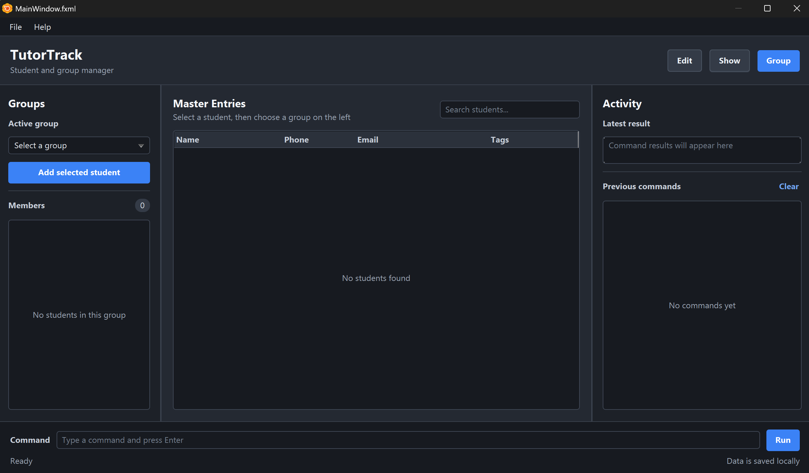

## About the application

This project is a desktop application for independent school teaching assistants (also known as tutors) who need a simple and efficient way to manage their students.

It brings essential student information together in one place so that tutors can spend less time organising records and more time teaching. The application is designed for tutors who prefer fast, keyboard-driven interactions while still benefiting from a clear graphical interface.

Key uses of the application include:

* keeping track of students and their contact details
* finding and viewing student records quickly
* updating student information as circumstances change
* organising the information needed for day-to-day tutoring work

## Acknowledgements

This project is based on the AddressBook-Level3 project created by the [SE-EDU initiative](https://se-education.org). The original AB3 project is a desktop application for managing contact details and serves as a teaching project and starting point for software engineering students.

For more information about the original project, see the [AddressBook Level 3 product website](https://se-education.org/addressbook-level3). To learn more about SE-EDU or contribute to its projects, visit [se-education.org](https://se-education.org/#contributing-to-se-edu).
